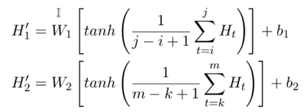

# **实验二：中文医疗关系抽取**

# 一、  实验目的

\1.    通过将符号化的文本转换为对应的向量序列，使学生掌握从词到向量的转换过程，进而更快地入门NLP相关任务。

\2.    通过将嵌入后的词语进行卷积等特征提取操作，从而将文本进行分类，能够使学生更直观地理解自然语言的处理过程，为后续的NLP任务做铺垫。

\3.    设置开放式的模型设计框架，能够使学生发挥想象力和创造力去创造更高效的模型。

\4.    尝试Prompt的方式使用LLM来进行关系抽取，能够使学生了解最新的前沿技术

# 二、  实验内容

大模型可以完成多样的复杂任务，但是在经典的nlp任务数据集上效果并不是非常显著，目前在专一任务领域还是BERT、T5等“小模型”效果更佳。

本次实验我finetune了BERT模型来完成关系抽取任务，另外，在本次的实验中，关系抽取任务已经被建模为分类任务。

在数据处理方面，我有两种构建数据集的方式。方式一是将两个实体与句子直接拼接，并且加入简单的prompt。方式二是拼接后，我标记出实体在句子中的attention mask，并用于后续的处理。标签均为44类。

在模型方面，我使用了bert-base-chinese模型，针对方式一构架的数据集，我采用了按照一般的bert模型微调的方式直接进行微调，利用[CLS]进行分类。针对方式二构建的数据集，我采用了将[CLS]与两个entity的output拼接为一个向量，通过linear进行分类。

# 三、  实验原理

## 3.1 BERT

BERT(Bidirectional Encoder Representation from Transformers)是2018年10月由Google AI研究院提出的一种预训练模型

BERT预训练是在大规模未标记的文本数据上通过自监督学习的方式进行训练。预训练可以学习文本数据中的语言模式和语义信息，以便在下游任务中进行迁移学习。BERT预训练目标有两个：掩码语言模型（Masked Language Model，MLM）和下一句预测（Next Sentence Prediction，NSP）。

\1.    MLM任务：在输入序列中随机掩码一些单词，模型需要预测这些掩码单词的正确标签，帮助模型学习单词之间的上下文关系和语义信息。

\2.    NSP任务：给定两个句子，模型需要判断这两个句子是否是连续的，帮助模型学习句子之间的关系和语义信息。[CLS]的训练只能通过这个任务，[CLS]可以用于本项目的文本分类。

模型训练的目的是让两个任务的损失函数最小化。BERT的架构由多个Transformer编码器层组成，包括一个输入嵌入层、多个编码器层和一些额外的任务特定层用于下游任务微调。在论文中，作者分别用12层和24层Transformer Encoder组装了两套BERT模型。

BERT的微调任务有四种：基于句子对的分类任务，基于单个句子的分类任务，问答任务，命名实体识别等。

\1.     基于句子对的分类任务，将两个句子传入 BERT，然后使用 [CLS] 的输出值C进行句子对分类。

\2.    单个句子分类:[CLS] 的输出值C进行分类。

 

\3.    另外还有问答任务，例如 SQuAD v1.1 数据集，样本是语句对 (Question, Paragraph)，Question 表示问题，Paragraph 是一段来自 Wikipedia 的文本，Paragraph 包含了问题的答案。而训练的目标是在 Paragraph 找出答案的起始位置 (Start，End)。

\4.   命名实体识别 (NER)，输入单个句子，然后根据 BERT 对于每个单词的输出T预测这个单词的类别，是属于 Person，Organization，Location，Miscellaneous 还是 Other (非命名实体)。

 

## 3.2任务定义

本次的试验任务为实体关系抽取。通常实体关系抽取的pipeline为：先是命名实体识别，提取出文本中所有的实体；然后是关系分类，预测判断提取的实体之间是否存在某种关系。

不过本次的任务中，实体已经被给出，所以可以采用字符串匹配方法找到文中的实体。不过，通过实验发现，单纯的字符串匹配有很多错误，所以还需要做**实体消歧**。

实验的关系分类任务可以建模为简单的分类任务。方法一：实体简单拼接输入分类。

方法二：将[CLS]与两个entity的output拼接为一个向量，通过linear进行分类。

 

# 四、  实验过程

## 4.1实体消歧

本次实验需要将所要的实体定位到在文本中的位置。但是经过实验发现有二个问题：entity缺失问题，head tail entity重叠问题。

 

### 4.1.1数据清洗

 我发现训练集数据总共为37965条，但是其中存在一些有缺失值的数据，我筛选出来如下面所示，有些head entity为subject_placeholder，有些本应为tail entity的位置是object_holder，这些属于缺失数据。筛选掉之后剩余36648条。

 

### 4.1.2实体重叠解决方法

 一开始在实体定位之后训练效果不佳，输出发现由于有些时候tail字符串是head字符串的子串，所以出现了重复识别，并且切割了应有的实体的情况。

另外检查了一下head字符串是tail字符串的子串的情况，但是检查数据集后发现：在这种情况下head对应实体总是在tail前面，所以遍历时无需考虑这一情况。

因此，最终需要在代码中考虑tail字符串是head字符串的子串的情况，需要跳过head对应的部分。

 

### 4.1.3实体对应的代码

 我采用了先将text进行tokenize化后，再将head和tail分别tokenize，随后进行列表切片对比

并且我还设置了sign_1，用于跳过第一个实体，因为两个实体被拼接到了text之前。

最终获得了data和label，其中，data有：head,tail,text拼接而成

然后使用BERT tokenize化，并且删除token_type，通过实体消岐增加e1_mask和e2_mask。每一条为一个字典，包含下面四个字段：

- Input_ids:每个token 的编码
- Attention_mask:一个01向量，没有pad的地方为1 
- E1_mask:实体head在句子中的位置为1
- E2_mask:实体tail在句子中的位置为1

另外，要注意BERT在tokenize化之后，上述的部分都会多一个维度：

所以在输入模型的时候需要squeeze。

## 4.2 直接使用BERT模型方法

首先是第一种数据构建方法：简单拼接法：

然后直接tokenize后进行输入。

 并且直接使用[CLS]进行分类，如下图：对于[CLS]直接添加一个linear层。

具体训练代码如下：将 input_ids和mask输入模型即可

 

## 4.3 R-BERT方法

借鉴论文《R-BERT：Enriching Pre-trained Language Model with Entity Information》的方法，使用了bert句首的特殊符号[CLS]，此外也插入相应的符号：第一个实体两侧的特殊符号是$，第二个实体两侧是#。

 输出的[CLS]作如下处理：

 输出的两个实体作如下处理：

 具体代码实现为：首先，模型输入为：

除了input_ids和mask，还输入了实体mask。

 模型结构：

先通过BERT得到输出，然后求得两个实体的每个token平均值，然后拼接[CLS]+entity1+entity2，然后通过一个层归一化，最后通过一个linear输出。

# 五、  实验结果与分析

 第一种方法，直接BERT方法训练结果：

 第二种方法，R-BERT方法训练结果：

训练的参数如下：

第一种方法BERT的测试集准确率为87.16%，R-BERT测试集准确率87.58%。

 

BERT模型在这种分类任务上表现优异，并且经过了更新分类器之后，效果得到了少许的提升，这一提升还不是很明显，我认为与

# 六、心得体会

在本次实验中我认为我对于BERT模型更加了解了。我对于BERT的输入输出更加了解，对于mask机制也更了解，因为我自己构建了实体mask，作为辅助的输入。

我对于模型选择更有深入体会了，因为在作业之前听到有些同学使用调用api方法，准确率只有50%，而纯粹重新搭建的bi-lstm, transformer正确率也不好，所以我直接采用了微调BERT的方法进行关系抽取，最终正确率达到满意的87.58%。在大模型时代，BERT等小模型仍有存在价值，因其在专业的数据集上通过微调可以达到更高准确率。

此外，我在实体消岐上花费了很多的时间，因为一开始我没有注意到head tail的实体性质，它们有重合的现象，最终通过数据分析设计算法解决了这个问题。